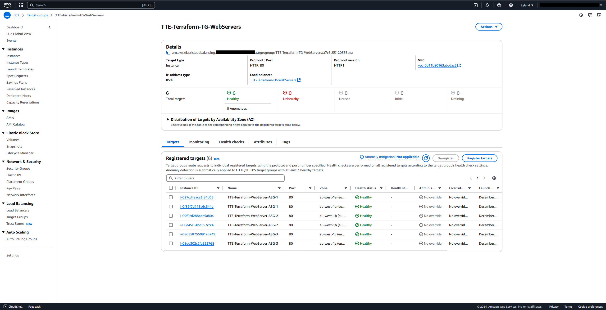
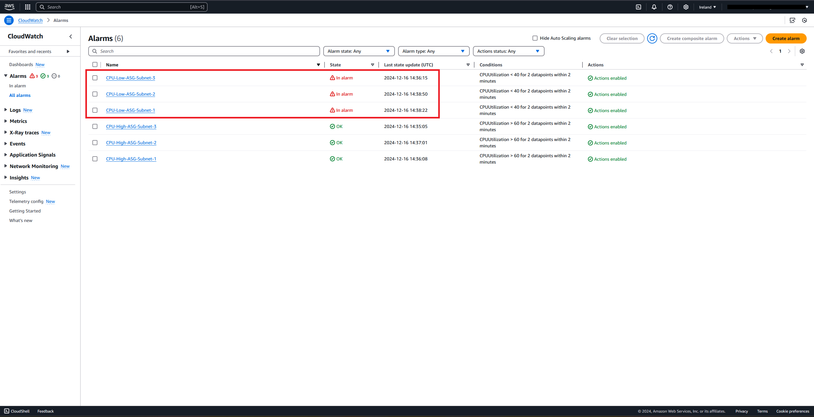
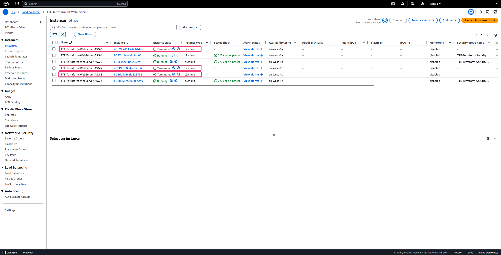

# Création d'une Infrastructure Scalable et Fiable sur AWS avec Terraform : Conception, Automatisation et Déploiement

## Contexte et But du Projet :

- Ce projet consiste à mettre en œuvre une infrastructure cloud automatisée et évolutive sur AWS à l'aide de Terraform. L'objectif est de permettre le déploiement de ressources telles qu'un load balancer applicatif, un groupe d'auto-scaling pour des instances EC2, et des groupes de sécurité associés, tout en garantissant leur gestion dynamique et leur redimensionnement automatique en fonction des charges. Ce travail met en pratique des compétences clés en infrastructure as code (IaC), scalabilité et fiabilité des systèmes cloud. Il s'inscrit dans le cadre d'un exercice pédagogique visant à maîtriser la conception et la gestion d'architectures cloud modernes, avec un accent particulier sur l'automatisation et la bonne gestion des coûts.

### Cahier des charges du projet

- Document: [5 - TP Terraform.pdf](./5%20-%20TP%20Terraform.pdf)
- Description: Ce document présente les spécifications et les exigences du projet. Il sert de référence pour définir les objectifs, les contraintes, les livrables attendus et le périmètre global du projet basé sur Terraform.

### Fichier de configuration Terraform main.tf

- Fichier: [5 - TP Terraform - main.tf](./5%20-%20TP%20Terraform%20-%20main.tf)
- Description: Le fichier main.tf est le fichier principal de configuration Terraform. Il contient les définitions clés de l'infrastructure, telles que les ressources à créer et les fournisseurs à utiliser. C’est le point d’entrée pour déployer l’infrastructure.

### Fichier de configuration Terraform variables.tf

- Fichier: [5 - TP Terraform - variables.tf](./5%20-%20TP%20Terraform%20-%20variables.tf)
- Description: Le fichier variables.tf est utilisé pour définir les variables d’entrée dans la configuration Terraform. Il permet de paramétrer la configuration pour la rendre flexible et réutilisable.

### Fichier de configuration Terraform outputs.tf

- Fichier: [5 - TP Terraform - outputs.tf](./5%20-%20TP%20Terraform%20-%20outputs.tf)
- Description: Le fichier outputs.tf définit les variables de sortie. Ces variables permettent d’afficher des informations importantes sur l’infrastructure après son déploiement, comme les identifiants ou les adresses des ressources créées.

### Fichier d'output de Terraform plan.sh

- Fichier: [5 - TP Terraform - plan.sh](./5%20-%20TP%20Terraform%20-%20plan.sh)
- Description: Ce fichier contient les résultats de la commande terraform plan exécutée depuis Terraform Cloud. Il s’agit d’un aperçu des modifications que Terraform apportera pour atteindre l’état souhaité de l’infrastructure, utile pour valider les changements avant leur application.

### Fichier d'output de Terraform apply.sh

- Fichier: [5 - TP Terraform - apply.sh](./5%20-%20TP%20Terraform%20-%20apply.sh)
- Description: Ce fichier contient les résultats de la commande terraform apply exécutée depuis Terraform Cloud. Il présente les actions réellement appliquées pour provisionner ou modifier l’infrastructure conformément aux configurations définies.

### Diagramme visuel de l'infrastructure déployée via l'outil IaC Terraform dans le cloud AWS

- Fichier: [5 - TP Terraform - Diagramme Visuel.vsdx](./5%20-%20TP%20Terraform%20-%20Diagramme%20Visuel.vsdx)
- Fichier: [5 - TP Terraform - Diagramme Visuel.pdf](./5%20-%20TP%20Terraform%20-%20Diagramme%20Visuel.pdf)

   

### Confirmation de l'exécution de "Terraform plan" & "Terraform apply" via Terraform.io :

  

### Confirmation création - AWS VPCs :

  

### Confirmation création - AWS Internet Gateways :

  

### Confirmation création - AWS Subnets :

  

### Confirmation création - AWS Route Tables :

  

### Confirmation création - AWS Security Groups - TTE-Terraform-SecurityGroup-LB - Inbound rules :

  

### Confirmation création - AWS Security Groups - TTE-Terraform-SecurityGroup-LB - Outbound rules :

  

### Confirmation création - AWS Security Groups - # TTE-Terraform-SecurityGroup-EC2-private - Inbound rules :

  

### Confirmation création - AWS Security Groups - # TTE-Terraform-SecurityGroup-EC2-private - Outbound rules :

  

### Confirmation création - AWS Target Groups :

  

### Confirmation création - AWS Load Balancers :

  

### Confirmation création - AWS Launch Templates :

  

### Confirmation création - AWS Auto-scaling groups - TTE-Terraform-WebServer-ASG-1 :

  

### Confirmation création - AWS Auto-scaling groups - TTE-Terraform-WebServer-ASG-2 :

  

### Confirmation création - AWS Auto-scaling groups - TTE-Terraform-WebServer-ASG-3 :

  

### Confirmation création - AWS CloudWatch Alarms :

  

### Confirmation création - Instances EC2 via l'Auto-scaling group :

  

### Confirmation de la fonctionalité d'équilibrage de charges avec le load balancer applicatif "TTE-Terraform-LB-WebServers" :

  

### Test de montée en charge des Serveurs Web avec le service Stress :

  

### Confirmation du déclenchement des alerts CloudWatch utilisé pour le scale-out :

  

### Observation de l'utilisation montante du CPU via l'alerte CloudWatch "CPU-High-ASG-Subnet-1" :

  

### Confirmation déclenchement des Auto Scaling Group pour la création des nouvelles Instances EC2 :

  

  

  

### Confirmation de l'ajout des nouvelles Instances EC2 dans la Target Group "TTE-Terraform-TG-WebServers" :

  

### Confirmation du déclenchement des alertes CloudWatch utilisé pour le scale-in :

  

### Observation de l'utilisation descendante du CPU via l'alerte CloudWatch "CPU-Low-ASG-Subnet-1" :

  

### Confirmation du déclenchement du Auto Scaling Group pour la suppresion des Instances EC2 :

  
